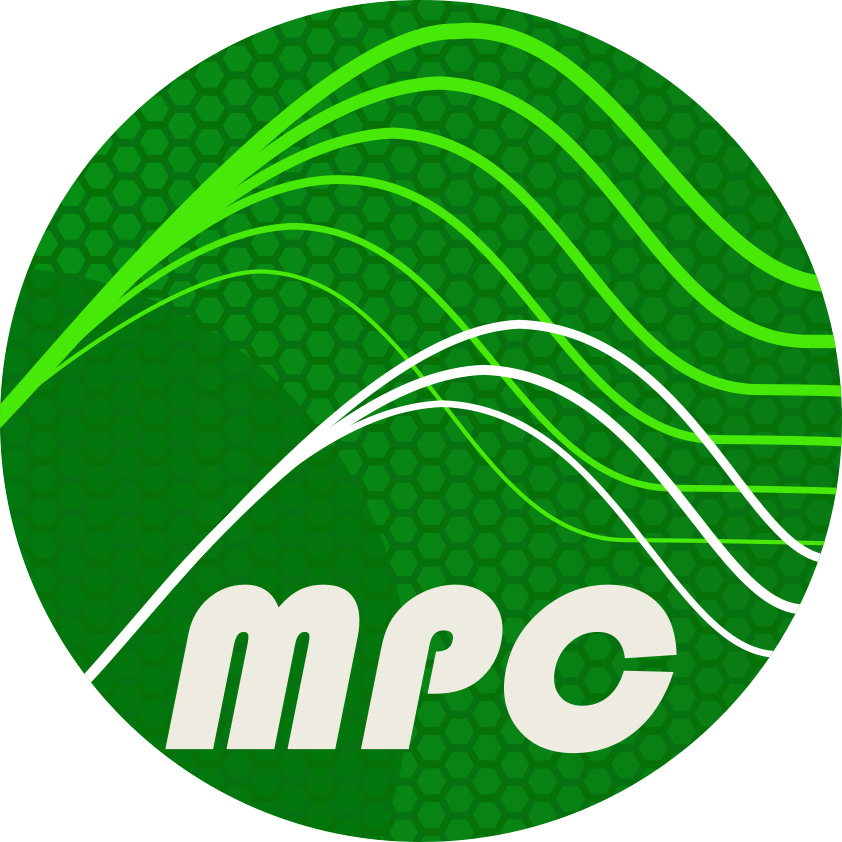

<div align="center"></div>

<div align="center"> <h1> Multi-Processor Computing </h1> </div>

**Multi-Processor Computing** (**MPC**) is a unified framework for High Performance Computing providing
the most commonly used tools to implement scientific computing software.
It includes a **MPI 3.1** compliant implementation (with latter extensions),
*user-level threading* engines supporting **PThread** specification and an **OpenMP 3** runtime (with parts of 4.0 and 5.0) relying on them.
**MPC** aims to be as modular as possible to allow users to use portions of its feature independently.

## Table of Contents

- [Installation](#installation)
  - [Build from source](#build-from-source)
  - [Install using spack](#using-spack)
- [Usage](#usage)
  - [Source *MPC*](#sourcing-mpc)
  - [Compile using *MPC*](#compile-using-mpc)
  - [Launch using *MPC*](#launch-using-mpc)
- [Documentation](#documentation)
- [Affiliated Projects](#affiliated-projects)
- [Changelog](CHANGELOG.md)
- [Contributors](#contributors)
- [Licence](#licence)

## Installation

### Build from source

#### Prerequisites

The following prerequisites are required to compile MPC:

- The main archive file from the [Downloads page](https://github.com/cea-hpc/mpc/tags)
- A **C** compiler (e.g., `gcc`)
- **GNU Autotools**

Other dependencies are automatically fetched by the `installmpc` helper script.

#### Standard installation

1. Unpack the main archive (tar format) and go to the top-level directory:

   ```console
   $ tar xfz MPC_<version>.tar.gz
   $ cd MPC_<version>
   ```

   <details> <summary> If your tar program does not accept the ’z’ option </summary>

   ```console
   $ gunzip MPC_<version>.tar.gz
   $ tar xf MPC_<version>.tar
   ```

   </details>

2. Choose an installation directory.

   > [!WARNING]
   > Using the default `/usr/local/` will overwrite legacy headers

   Create a build directory

   ```console
   $ mkdir BUILD
   ```

3. From the build directory, launch the installation script for MPC and its dependencies. Specifying the
   installation directory:

   ```console
   $ <path/to/mpc>/installmpc --prefix=<path/to/installation/directory>
   ```

   > [!NOTE]
   > Use the flag `-jX` to specify a parallel installation.
   > `X` should be a number and is the total amount of processes launched by *Make*.
   > By default the `X` is the number of cores of the machine.

<details> <summary><h5>Common options for installmpc</h5></summary>

The whole list of options can be retrieved using

```console
$ <path/to/mpc>/installmpc -h
```

The most commonly used are

- `--prefix` to specify the installation path
- `--enable-lsp` to run *bear* and produce a `compile_commands.json` file
- `--with-slurm` to activate the support of *SLURM* using *PMI*
- `--process-mode` to deactivate the privatization features and remove the dependency on [MPC Compiler Additions]
- `--enable-debug` to build in Debug mode
- `--disable-<module|dep>` to disable certain module or dependency provided features
- `--with-cuda` to enable CUDA support
- `--with-rocm` to enable ROCm/hip support

</details>
<details> <summary><h4> Step by step installation</h4></summary>

If you decide to install MPC without the helper script, you will need the following dependencies

- *HWLOC* and *OpenPA* libraries installed
- Optionally a **Fortran** compiler if Fortran applications are to be used (e.g., `g77` or `gfortran`)
- Optionally *SLURM*
- Optionally *libfabric* and network libraries (*portals*, *ibverbs*...)

*MPC* relies on the *Autotools* toolchain as a build system. The standard way to install it without the convenience
script is the following

```console
$ ./autogen.sh
$ cd <BUILD> && <path/to/mpc>/configure --prefix=<path/to/installation/directory>
$ make install -j
```

The previous section described the default installation and configuration of
MPC, but other alternatives are available. You can find out more details on the
configuration by running:

```console
$ <path/to/mpc>/configure --help
```

Specify the PMI based launcher to be used by MPC as follows:

- `--with-hydra[=prefix]`: Compile MPC with the **Hydra** launcher (embedded in the MPC
  distribution). This option is enabled by default.
- `--with-slurm[=prefix]` Compile MPC with the **SLURM** launcher.

Specify external libraries used by MPC:

- `--with-hwloc=prefix`: Specify the prefix of hwloc library
- `--with-openpa=prefix`: Specify the prefix of OpenPA library
- `--with-mpc-binutils=prefix`: Specify the prefix of the binutils

Specify external libraries for gcc compilation:

- `--with-gmp=prefix`: Specify the prefix of gmp library
- `--with-mpfr=prefix`: Specify the prefix of mpfr library
- `--with-mpc=prefix`: Specify the prefix of mpc multiprecision library

Specify external gcc and gdb:

- `--with-mpc-gcc=prefix`: Specify the prefix of the gcc used by MPC
- `--with-mpc-gdb=prefix`: Specify the prefix of the gdb used by MPC

</details>

### Using Spack

[Spack](https://github.com/spack/spack) is a user-based package manager tailored to be used on supercomputers.
Spack offers mechanisms to manage configurations and dependencies of the installed packages.
For more information on how to use spack, see the [spack documentation](https://spack.readthedocs.io/).

MPC related projects have spack recipes that can be found [here](<>).
You can install MPC through spack following those instructions

- Add the MPC repository to your spack installation

  ```console
  $ spack repo add <mpc_repository>
  ```

- See the configuration options

  ```console
  $ spack info mpcframework
  ```

- Install MPC

  ```console
  $ spack install mpcframework
  ```

For more information concerning installation, please refer to [INSTALL](INSTALL).

## Usage

### Sourcing MPC

1. Source the *mpcvars* script (located at the root of the MPC installation
   directory) to update environment variables

   <details><summary>For <b>bash</b>, <b>sh</b> and <b>zsh</b></summary>

   ```console
   $ source <path/to/installation/directory>/mpcvars.sh
   ```

   </details>

   <details> <summary>For <b>csh</b> and <b>tcsh</b></summary>

   ```console
   $ source <path/to/installation/directory>/mpcvars.csh
   ```

   </details>

   Alternatively, if you installed *MPC* using *spack*, load the package

   ```console
   $ spack load mpcframework
   ```

2. Check that everything went well at this point by running

   ```console
   $ mpc_cc --help
   $ mpcrun --help
   ```

### Compile using MPC

#### Standard MPI compilers

MPC does provide standard MPI compilers such as `mpicc`, `mpic++`, `mpicxx`, `mpif77` and `mpif90`.
Those compilers can be used as drop-in replacements for your application.
They should behave in similar ways than those made available by other providers.

These compiler will call MPC but won't privarize by default (process-mode). If you'd like to port an existing
build system relying on mpicc you may `export MPI_PRIV=1` which will turn on privatization in these wrappers.

For example:

```sh
$ MPI_PRIV=1 mpicc hello.c -o hello
# Will be strictly equivalent to
$ mpc_cc hello.c -o hello.c
```

#### Custom MPC compilers

*MPC* provides custom compilers `mpc_cc`, `mpc_cxx` and `mpc_f77`.
Those compilers allow the user to specify MPC-specific options.
For instance, those compilers use the auto-privatization by default (if *MPC* was compiled with privatization support).

To compile MPC program from C sources, you may execute the `mpc_cc` compiler:

```console
$ mpc_cc hello_world.c -o hello_world
```

This command uses the main default *GCC* (patched if privatization support enabled) to compile the code.
If you want to use your favorite compiler instead (losing some features like OpenMP
support and global-variable removal), you may use the *mpc_cflags* and
*mpc_ldflags* commands:

```sh
$ <path/to/installation/directory>/bin/mpc_cc -cc=${CC} hello_world.c -o hello_world
# Or, in a more explicit way
$ ${CC} hello_world.c -o hello_world $(mpc_cflags) $(mpc_ldflags)
```

For more information about the options proposed by these compilers, please refer to the `--help` option

```console
$ mpc_(cc|cxx|f77) --help
```

### Launch using MPC

*MPC* provides multiple launcher wrappers to launch your application in a parallel and distributed environment.

#### Standard MPI runners

The *MPI* standard `mpiexec` launcher and the convenience, community-adopted `mpirun` one are installed with
*MPC* if the *MPI* support is enabled.
They can be used a drop-in replacement to the ones provided by other implementation.
To launch a simple program with 2 process

```console
$ mpirun -n 2 <your/application>
```

> [!IMPORTANT]
> MPC is not yet MPI 5.0 ABI compliant,
> Compiling and running a program with different MPI implementation is an undefined behavior
>
> Please make sure the program you try to run has been compiled using *MPC* compilers

#### Custom MPC runner

Alternatively, one can use the `mpcrun` scripts to benefit from all the features of *MPC*.
This command allows the user to select the threading engine, the underlying network, the launcher,
pass through options to the launcher...
It is the preferred way to launch thread-based programs.
Consider the following examples

```sh
# Launching 4 tasks MPI within one UNIX process (using one core per task)
$ mpcrun -m=ethread_mxn -p=1 -n=4 -c=4 <your/application>

# Launching 4 tasks MPI each a UNIX processes
$ mpcrun -p=4 -n=4 <your/application>

# Launching 4 tasks MPI within two UNIX processes with pthread and 4 threads by process (2 by task)
$ mpcrun -m=pthread -p=2 -n=4 -c=4 <your/application>
```

The mpcrun script drives the launch of MPC programs with different types of
parallelism. Another common usecase is to use the SLURM launcher.
In such cases, it becomes handy to pass through options to SLURM

```sh
# Launching 2 tasks on 2 nodes from the <partition> partition
$ mpcrun -l=srun -n=2 -N=2 --opt="--partition=<partition>" <your/application>
```

The most common options used with `mpcrun` are

```console
-N=n, --node-nb=n               Total number of nodes
-p=n, --process-nb=n            Total number of UNIX processes
-n=n, --task-nb=n               Total number of tasks
-c=n, --cpu-nb=n                Number of cpus per UNIX process

-m=n, --multithreading=n        Define multithreading mode

-net=n, --net=, --network=n     Define Network mode

-l=n, --launcher=n              Define launcher
--opt=<options>                 Launcher specific options

--cuda                          Enable CUDA support
--rocm                          Enable ROCm support

-v,-vv,-vvv,--verbose=n         Verbose mode (level 1 to 3)
```

For more information about the options to launch an application using MPC, please refer to the `mpcrun` help

```console
$ mpcrun --help
```

> [!NOTE]
> This command also provides the list of available multithreading and network modes

## Documentation

<!-- > [!ERROR] Generate GitHub pages and deploy them -->

<!-- > Then, we should in priority lead users to the deployed documentation -->

> [!WARNING]
> The documentation is not deployed for now,
> It will be in a near future release

The documentation is composed of three main parts

- **User Documentation**: Providing more insights *MPC* features and how to use the different modules
- **Contributor Guide**: Providing rules and tips on how to contribute and the developer tools used
- **Code Documentation**: Providing code-level documentation though in-code Doxygen comments

> [!CAUTION]
> Code documentation is under heavy work
> The information contained in it may be incomplete and/or inaccurate

### Build the documentation

A more in-depth documentation can be generated in the `doc` directory.
To build the documentation, you will need the following

- Doxygen
- All the python packages listed in `requirements.txt`
  ```sh
  # Install the python packages
  $ pip install -r requirements.txt
  ```

To build the documentation, simply run the provided script

```console
$ ./gen_doc
```

The documentation is generated in HTML format under `<MPC_ROOT>/doc/build/(sphinx|doxygen)/html`.
The main entry in the documentation is the `index.html` file

```sh
# Use any browser of your liking
$ firefox build/(sphinx|doxygen)/html/index.html
```

## Affiliated Projects

The MPC Team is also responsible for the following related projects:

- [MPC Compiler Additions]
  A GCC fork implementing the auto-privatization for threading contexts
- [MPC Allocator]
  A custom memory allocator
- [PCVS](https://github.com/cea-hpc/pcvs)
  A tests and benchmarks engine designed for HPC distributed systems

## Contributors

In case of question, feature or need for assistance, please contact any of the current member of the MPC Team:

- TABOADA Hugo hugo.taboada@cea.fr
- REYNIER Florian florian.reynier@cea.fr
- MARIE Nicolas nicolas.marie@uvsq.fr
- PEYSIEUX Anis anis.peysieux@cea.fr
- BEAULIEU Corentin corentin.beaulieu@cea.fr

The MPC Team wants to thank all the maintainers and contributors who made this project what it is.
You can find an exhaustive list of all the contributors and maintainers of *MPC* in the [AUTHORS](./AUTHORS.md) file.

## Licence

MPC is distributed under the terms of the CeCILL-C Free Software Licence Agreement.

All new contributions must be made under the CeCILL-C terms.

For more details, see [COPYING](COPYING) or [LICENCE](https://spdx.org/licenses/CECILL-C.html)

SPDX-Licence-Identifier: CECILL-C

<!-- Links -->

[mpc allocator]: https://github.com/cea-hpc/mpc-allocator
[mpc compiler additions]: https://github.com/cea-hpc/mpc-compiler-additions
