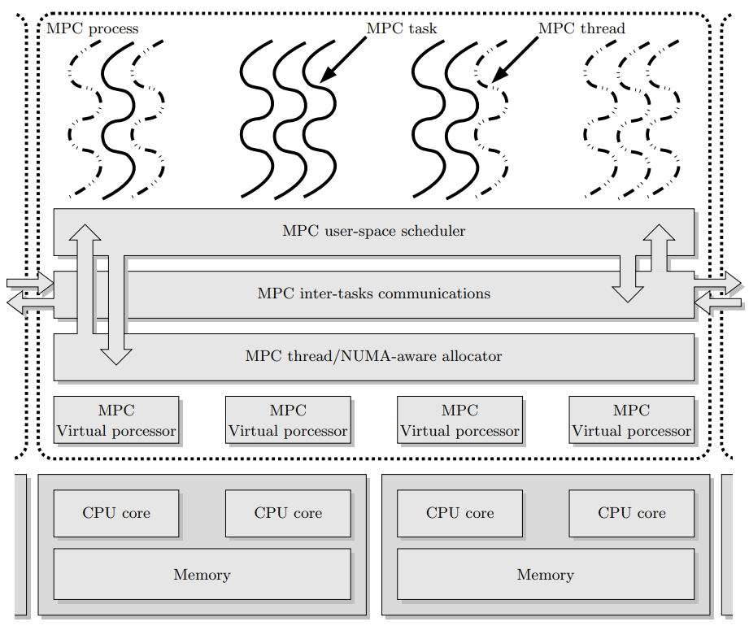

Runtime options
===============

Main options
------------

mpcrun provides several options for configuring the launch process. These include:

* `-N=n`: Total number of nodes (default: 1)
* `-p=n`: Total number of UNIX processes (default: 1)
* `-n=n`: Total number of tasks (default: 1)
* `-c=n`: Number of cpus per UNIX process (default: 1)

You can see the hierarchy of tasks and processes in mpc runtime : 

	mpc execution model as described in `this paper <https://hpcframework.com/wp-content/uploads/2015/06/MPC-A-Unified-Parallel-Runtime-for-Clusters-of-NUMA-Machines.pdf>`_

For example ``mpcrun -N 4 -p 8 -n 16 ./my_mpi_app`` launches `my_mpi_app` with 4 nodes, each having 2 processes, and each process running 4 tasks.

Multithreading
--------------

MPCrun also provides options for configuring multithreading:

* `-m=n`: Define multithreading mode (default: none)
	+ `pthread`: Use pthreads for multithreading
	+ `ethread_mxn`: Use ethreads with mxn scheduling

For example ``mpcrun -m pthread ./my_mpi_app`` launches `my_mpi_app` using pthreads for multithreading.

Networking
----------

mpcrun provides options for configuring the network:

* `-net=n`: Define Network mode (default: tcpshm)
	+ `shm`: Use shared memory for inter-process communication
	+ `tcpshm`: Use TCP/IP with shared memory for inter-process communication

For example ``mpcrun -net shm ./my_mpi_app`` launches `my_mpi_app` using shared memory for inter-process communication. For a complete list of available networks please refer to the :doc:`complete documentation<networks>`

Launcher
--------

mpcrun provides options for configuring the debugger:

* `-dbg=<debugger_name>`: Use a specific debugger (default: none)

For example ``mpcrun -dbg=gdb ./my_mpi_app`` launches `my_mpi_app` using GDB as the debugger.

You can also launch your binaries as such if you want to keep the UNIX process outputs separate :

::
    mpcrun -n=2 -p=2 xterm -hold -e gdb -ex r ./my_mpi_app

**srun**

The partition selection is not included directly into mpcrun command. However you can use this syntax to chose a partition :

::

    mpcrun --opt="-p [partition]" ./a.out

Other Options
-----------------

MPCrun provides several other options for customizing the launch process. These 
include:

* `-h`, `--help`: Display this help message
* `--show`: Display command-line arguments
* `-v`, `-vv`, `-vvv`, `--verbose=n`: Verbose mode (level 1 to 3)
	+ Level 1: Show basic information about the launch process
	+ Level 2: Show detailed information about the launch process
	+ Level 3: Show very detailed information about the launch process

For example ``mpcrun -v ./my_mpi_app`` launches `my_mpi_app` with verbose mode set to level 1.

Examples
------------

Here are a few examples of using MPCrun:

Example 1:

::

	mpcrun -N 4 -p 8 -n 16 -m pthread -net shm -l hydra ./my_mpi_app

This launches `my_mpi_app` with 4 nodes, each having 2 processes, and each process 
running 4 tasks. It uses pthreads for multithreading and shared memory for 
inter-process communication. The launcher is Hydra.

Example 2:

::

	mpcrun -dbg=gdb ./my_mpi_app

This launches `my_mpi_app` using GDB as the debugger.