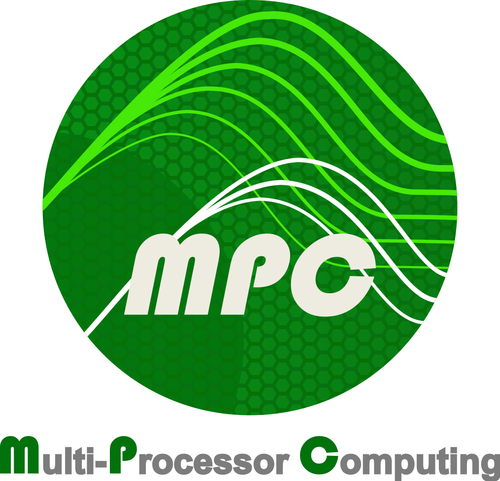

=========================
Multi-Processor Computing
=========================

The Multi-Processor Computing runtime (MPC) is a unified runtime targeting the
MPI, OpenMP and PThread standards. One of its main specificities is the ability to
run MPI Processes inside threads, being a thread-based MPI.

MPC supports the MPI 3.1 standard in both thread-based and process-based flavors
and was optimized for the Infiniband and Portals 4 networks. In MPC,
**MPI_THREAD_MULTIPLE** is always on enabling the transparent use of shared-memory
parallelism with MPI.

MPC comes with a suite of privatizing compilers which enable the transparent
port of existing codes to the thread-based execution paradigm. To do so, MPC
extended the support of TLS which are now hierarchical.

Running inside threads enables lower latencies inside nodes (as messages are
direct memcpys). It requires fewer communication endpoints, one per node instead
of one per core, leading to memory and launch time improvements.

-----------------------------------
Supported Parallel Programming APIs
-----------------------------------

MPC provides implementations for the MPI, OpenMP and POSIX Threads standards.
All these standards can be mixed together in an efficient way, thanks to process
virtualization. MPC has been ported on x86 and x86_64  with Linux system,  and
supports TCP, InfiniBand and Portals4 interconnects.

'''
MPI
'''

MPC provides its own MPI implementation, and fully respects the MPI 3.1
standard, such as an efficient MPI_THREAD_MULTIPLE support, a full MPI I/O
support, a full non-blocking collectives support and an efficient Generalized
requests support.

MPC provides a thread-based MPI implementation (e.g MPI processes are threads
and not OS processes). MPC’s communications are implemented in the following
way: intra-node communications involve several MPI Processes in a unique OS
process (MPC’s default mode uses one OS process per node). These MPI Processes
use the optimized thread-scheduler polling method and thread-scheduler
integrated collectives to communicate with each other. As far as inter-node
communications are concerned, MPC uses direct access to the TCP, InfiniBand or
Portals4 interconnect. MPC provides performances close to MPICH or OpenMPI, but
with a much better support of hybrid programming models (e.g., MPI/PThreads,
MPI/OpenMP...) and lower memory consumption.

MPC also provides a process-based way of using its MPI implementation.

''''''
OpenMP
''''''

MPC provides its own OpenMP implementation, and fully respects the OpenMP 3.1
standard. MPC allows compilation and execution of C/C++ and Fortran OpenMP
applications thanks to GNU and Intel compilers support. The main MPC package
contains a patched version of GCC (6.2) called MPC_GCC which is automatically
installed when building MPC. The OpenMP implementation is also compatible with
Intel C/C++ and FORTRAN compilers starting at version 15.0.

The OpenMP runtime has been optimized to efficiently support large NUMA
architectures and hybrid MPI/OpenMP codes.

''''''''''''''
Thread Library
''''''''''''''

MPC comes with its own MxN thread library and POSIX Thread implementation. MxN
thread libraries provide lightweight user-level threads that are mapped to
kernel threads. One key advantage of the MxN approach is the ability to optimize
the user-level thread scheduler to create and schedule a very large number of
threads with a reduced overhead. The MPC thread scheduler provides a polling
method that avoids busy-waiting and keeps a high level of reactivity for
communications, even when the number of tasks is much larger than the number of
available CPU cores. Furthermore, collective communications are integrated into
the thread scheduler to enable efficient barrier, reduction and broadcast
operations.

''''''''
Features
''''''''

Thread debugging
################

Support for debugging user-level MPC threads is provided thanks to an
implementation of the libthread_db and a patch to the GNU Debugger (GDB). It
allows to manage user-level threads in GDB and all GUIs based on GDB. MPC is
also compatible with Allinea’s DDT Debugger.

Thread safety
#############

Because MPC provides a thread-based MPI implementation, a mechanism is needed to
deal with global-variable sharing in the application.

Such thread-safety issues are managed with automatic privatization of global
variables. This mechanism is automatically appplied by the compiler for C/C++
and Fortran MPI codes through the new -fmpc-privatize option. This new option is
available in MPC_GCC (provided with the MPC package) and Intel compilers
(starting with version 15.0 for C/C++ and Fortran).

Memory Allocator
################

The MPC thread library comes with a thread-aware and NUMA-aware memory allocator
(`malloc`, `calloc`, `realloc`, `free`, `memalign` and `posix_memalign`). It implements a
per-thread heap to avoid contention during allocation and to maintain data
locality on NUMA nodes. Each new data allocation is first performed by a
lock-free algorithm on the thread private heap. If this local private heap is
unable to provide a new memory block, the requesting thread queries a large page
to the second-level global heap with a synchronization scheme. A large page is a
parametrized number of system pages. Memory deallocation is locally performed in
each private heap. When a large page is totally free, it is returned to the
second-level global heap with a lock-free method. Pages in second-level global
heap are virtual and are not necessarily backed by physical pages. On a same
node, memory pages freed by a thread are provided to new allocations of other
threads without any system call.

Hierarchical Local Storage (HLS)
################################

HLS is a set of directives in C, C++ and Fortran allowing the application
developer to share global variables across MPI tasks running on a same node. The
HLS extension can be used to reduce the memory footprint of MPI programs by
avoiding to duplicate data that are common to all MPI tasks. One typical use
case of HLS variables is a large table of physical constants. With the HLS
extension, only one table per node will be allocated instead of one table per
core (if there is one MPI task per core) thus reducing the memory consumption by
a factor equal to the number of cores per node.

-----------------
MPC Documentation
-----------------

MPC Documentation is under active development and can be found in the following
locations:

- The Official website for the whole project: (http://mpc.hpcframework.com/) 
- In-place documentation (within source code), under Doxygen formatting. Please
note that this is currently in progress and not everything is fully documented. 
Feel free to contact one of the maintainers mentioned in the MAINTAINERS file.
- A complete documentation based on currently-written Doxygen AND Markdown files
placed in modules that can be generated. Please consult the /doc/Doxyfile.in
to customize the generation to the needs. Once ready, please run
``./doc/gen_doc``. Be sure to have Doxygen in your PATH along with Graphviz (not
mandatory) for drawings.

-----------------
Table of Contents
-----------------

.. toctree::
   :maxdepth: 2
   :caption: Basics

   start
   build
   runtime
   networks
   faq
   issues

.. toctree::
   :caption: Advanced

   privatization

.. toctree::
   :caption: Resources

   contribute
   changelog
   annex

.. toctree::
   :caption: Links

   Official Website (mpc.hpcframework.com) <https://mpc.hpcframework.com>
   Repository (github.com) <https://github.com/cea-hpc/mpc>
   Publications (mpc.hpcframework.com) <https://mpc.hpcframework.com/publications-2/>
