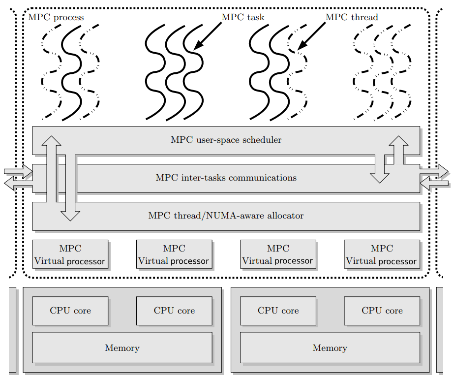

Runtime options
===============

This is the plain man page of mpcrun. You can find this exact text using ``mpcrun -h``.

Usage

.. code-block::

    mpcrun [option] [--] binary [user args]

Main options
------------

mpcrun provides several options for configuring the launch process. These include:

.. table:: Common mpcrun options
   :align: center

   ======================== ==============================================
   ``-N=n,--node-nb=n``     Total number of nodes            (default: 1)
   ``-p=n, --process-nb=n`` Total number of UNIX processes   (default: 1)
   ``-n=n, --task-nb=n``    Total number of MPC tasks        (default: 1)
   ``-c=n, --cpu-nb=n``     Number of cpus per UNIX process  (default: 1)
   ``--cpu-nb-mpc=n``       Number of cpus per MPC tasks
   ``--enable-smt``         Enable SMT capabilities (disabled by default)
   ``--mpmd``               Use mpmd mode (replaces binary)
   ======================== ==============================================

You can see the hierarchy of tasks and processes in mpc runtime :

   MPC execution model as described in `this paper <https://hpcframework.com/wp-content/uploads/2015/06/MPC-A-Unified-Parallel-Runtime-for-Clusters-of-NUMA-Machines.pdf>`_

Traditionally, an MPC program is launched using a combination of ``-N``, ``-n`` and ``-c``.

For example ``mpcrun -N 4 -p 8 -n 16 ./my_mpi_app`` launches `my_mpi_app` with 4 nodes, each having 2 processes, and each process running 4 tasks.

.. warning::

   The ``-p`` option is specific to thread-based. It will have no effect if used with MPC compiled in process-mode.

Multithreading
--------------

.. table::
   :align: center

   ============================ ==================================
   ``-m=n, --multithreading=n`` Define underlying threading engine
   ============================ ==================================

The most common modes are
   * **pthread**
     Use POSIX threads to ensure multithreading
   * **ethread_mxn**
     Use MPC own user level threading engine
   * **ethread**
     Use MPC own user level threading engine for debug purposes (only one thread at a time)

Network
-------

.. table::
   :align: center

   =============================== ===================
   ``-net=n, --net=, --network=n`` Define Network mode
   =============================== ===================

Using the help command, the available networks configuration should be displayed as follow

.. code-block:: console
   :caption: Example of available network configurations

   Configured CLI switches for network configurations (default: tcpshm):

   - shm:
      * tbsmmpi
      * shmmpi

   - verbsshm:
      * tbsmmpi
      * shmmpi
      * verbsofirail

   - verbs:
      * tbsmmpi
      * verbsofirail

Launcher
--------

.. table::
   :align: center

   ====================== ===============
   ``-l=n, --launcher=n`` Define launcher
   ====================== ===============

Using the help command, the available launchers should be displayed as follow

.. code-block:: console
   :caption: Example of available launchers

   Available launch methods (default is srun):
      - none
      - none_mpc-gdb
      - salloc_hydra
      - srun

.. table::
   :align: center

   ====================== ====================================
   ``--opt=<options>``    Launcher specific options
   ``--launchlist``       Print available launch methods
   ``--config=<file>``    Configuration file to load
   ``--profiles=<p1,p2>`` List of profiles to enable in config
   ====================== ====================================

.. note::

   The ``--opt`` option is used to pass through options to the underlying launcher.
   It is commonly used to specify the wanted partition to slurm

   .. code-block::

      mpcrun -N=2 -n=2 --opt="-p <partition>" -- ./a.out

Information
------------

.. table::
   :align: center

   =========================== =====================================================================================================
   ``-h, --help``              Display this help
   ``--show``                  Display command line

   ``-v,-vv,-vvv``             Verbose mode (level 1 to 3)
   ``--verbose``               Verbose level 1
   ``--graphic-placement``     Output a xml file of thread placement and topology for each compute node
   ``--text-placement``        Output a txt file of thread placement and topology for each compute node
   =========================== =====================================================================================================

The verbose level are defined as such
   + Level 1 (v): Show basic information about the launched process
   + Level 2 (vv): Show logs information about the launched process
   + Level 3 (vvv): Show very detailed debug information about the launched process

Debugger
--------

mpcrun provides options for configuring the debugger:

.. table::
   :align: center

   ========================= =================
   ``--dbg=<debugger_name>`` to use a debugger
   ========================= =================

You can also launch your binaries as such if you want to keep the UNIX process outputs separate :

.. code:: console

    mpcrun -n=2 -p=2 xterm -hold -e gdb -ex r ./my_mpi_app
